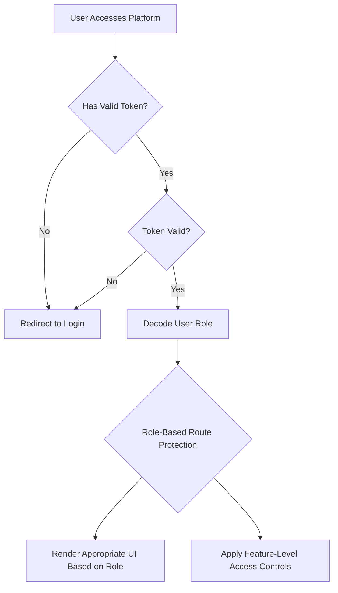

# Frontend Feature Integration with Role-Based Authentication

## Table of Contents
1. [Overview](#overview)
2. [Role-Based Access Control System](#role-based-access-control-system)
3. [Feature Integration Matrix](#feature-integration-matrix)
4. [Frontend Architecture](#frontend-architecture)
5. [Component Structure](#component-structure)
6. [Authentication Implementation](#authentication-implementation)
7. [Role-Specific Feature Access](#role-specific-feature-access)
8. [UI/UX Considerations](#uiux-considerations)
9. [Performance Optimization](#performance-optimization)
10. [Testing Strategy](#testing-strategy)
11. [Implementation Roadmap](#implementation-roadmap)

## Overview

This document outlines the comprehensive integration of all platform features into the frontend with a robust role-based authentication system. The implementation ensures that users can only access features appropriate to their role (Admin, Contributor, Learner) while maintaining a seamless and intuitive user experience.

## Role-Based Access Control System

### Role Definitions

1. **Admin (role_id = 1)**
   - Full access to all platform features
   - User management and role assignment
   - Content creation, editing, and deletion
   - System configuration and monitoring
   - Analytics and reporting
   - Africa's Talking integration management
   - AI service management

2. **Contributor (role_id = 2)**
   - Create and manage learning content
   - Edit and update their own content
   - View analytics for their content
   - Moderate comments on their content
   - Access to basic platform statistics

3. **Learner (role_id = 3)**
   - Access learning paths and modules
   - Complete quizzes and assessments
   - Track progress and achievements
   - Earn badges and points
   - Participate in discussions
   - Access personalized recommendations

### Authentication Flow



## Feature Integration Matrix

### Core Features by Role

| Feature | Admin | Contributor | Learner | Description |
|---------|-------|-------------|---------|-------------|
| **User Management** | ✅ Full Access | ❌ No Access | ❌ No Access | Create, edit, delete users; assign roles |
| **Content Creation** | ✅ Full Access | ✅ Own Content | ❌ No Access | Create learning paths, modules, resources |
| **Content Editing** | ✅ All Content | ✅ Own Content | ❌ No Access | Edit existing content |
| **Content Deletion** | ✅ All Content | ✅ Own Content | ❌ No Access | Delete content |
| **Learning Access** | ✅ Full Access | ✅ Full Access | ✅ Full Access | Access all learning materials |
| **Progress Tracking** | ✅ All Users | ✅ Self Only | ✅ Self Only | View progress and achievements |
| **Quiz Taking** | ✅ Full Access | ✅ Full Access | ✅ Full Access | Take quizzes and assessments |
| **Commenting** | ✅ Full Access | ✅ Full Access | ✅ Full Access | Comment on resources |
| **Analytics Dashboard** | ✅ Full Access | ✅ Limited | ❌ No Access | Platform and content analytics |
| **System Configuration** | ✅ Full Access | ❌ No Access | ❌ No Access | Platform settings and configuration |
| **Role Management** | ✅ Full Access | ❌ No Access | ❌ No Access | Assign and manage user roles |
| **Content Moderation** | ✅ All Content | ✅ Own Content | ❌ No Access | Moderate comments and user content |
| **AI Services** | ✅ Full Access | ❌ No Access | ❌ No Access | Manage AI features and settings |
| **Africa's Talking** | ✅ Full Access | ❌ No Access | ❌ No Access | Manage USSD/SMS integration |

### Detailed Feature Breakdown

#### 1. User Management (Admin Only)
- User list with search and filtering
- User creation form
- User profile editing
- Role assignment interface
- Bulk user operations
- User activity monitoring
- Account status management (activate/deactivate)

#### 2. Content Management
**Admin Features:**
- Complete learning path management
- Module creation and organization
- Resource upload and management
- Content categorization and tagging
- Publication status control
- Content analytics and reporting

**Contributor Features:**
- Create learning paths they own
- Add modules to their learning paths
- Upload resources to their modules
- Edit their own content
- View analytics for their content

**Learner Features:**
- Browse and search learning paths
- Enroll in learning paths
- Access modules and resources
- Track progress through content

#### 3. Learning Experience
**All Roles:**
- Interactive learning modules
- Video and document resources
- Quiz and assessment system
- Progress tracking
- Bookmarking favorite content
- Download offline materials

#### 4. Community Features
**All Roles:**
- Commenting system
- Discussion forums
- Peer interaction
- Content rating and feedback
- Social sharing

#### 5. Gamification
**All Roles:**
- Badge earning system
- Points accumulation
- Leaderboard participation
- Achievement tracking
- Streak maintenance

#### 6. Personalization
**All Roles:**
- Personalized recommendations
- Learning path suggestions
- Adaptive difficulty adjustment
- Custom learning goals
- Progress visualization

#### 7. Analytics and Reporting
**Admin:**
- Platform-wide analytics
- User engagement metrics
- Content performance reports
- System health monitoring
- Financial and usage statistics

**Contributor:**
- Content performance analytics
- Learner engagement metrics
- Quiz completion rates
- Resource usage statistics

**Learner:**
- Personal progress reports
- Learning history
- Achievement tracking
- Goal progress visualization

#### 8. System Administration
**Admin Only:**
- Platform configuration
- Role and permission management
- API key management
- System monitoring
- Backup and recovery
- Security settings

#### 9. Integration Management
**Admin Only:**
- Africa's Talking USSD/SMS management
- AI service configuration
- Third-party API integrations
- Webhook management
- Integration monitoring

## Frontend Architecture

### Component Hierarchy

```
src/
├── components/
│   ├── Auth/
│   │   ├── Login.jsx
│   │   ├── Signup.jsx
│   │   ├── ProtectedRoute.jsx
│   │   └── RoleBasedRoute.jsx
│   ├── Shared/
│   │   ├── Navbar.jsx
│   │   ├── Sidebar.jsx
│   │   ├── Footer.jsx
│   │   ├── LoadingSpinner.jsx
│   │   └── ErrorBoundary.jsx
│   ├── Dashboard/
│   │   ├── AdminDashboard.jsx
│   │   ├── ContributorDashboard.jsx
│   │   ├── LearnerDashboard.jsx
│   │   └── DashboardLayout.jsx
│   ├── Users/
│   │   ├── UserList.jsx
│   │   ├── UserForm.jsx
│   │   ├── UserProfile.jsx
│   │   └── RoleManagement.jsx
│   ├── Content/
│   │   ├── LearningPaths/
│   │   │   ├── PathList.jsx
│   │   │   ├── PathForm.jsx
│   │   │   ├── PathDetail.jsx
│   │   │   └── PathCard.jsx
│   │   ├── Modules/
│   │   │   ├── ModuleList.jsx
│   │   │   ├── ModuleForm.jsx
│   │   │   └── ModuleCard.jsx
│   │   ├── Resources/
│   │   │   ├── ResourceList.jsx
│   │   │   ├── ResourceForm.jsx
│   │   │   ├── ResourceCard.jsx
│   │   │   └── CloudinaryUpload.jsx
│   │   └── ContentLayout.jsx
│   ├── Learning/
│   │   ├── LearningPathView.jsx
│   │   ├── ModuleView.jsx
│   │   ├── ResourceView.jsx
│   │   ├── QuizView.jsx
│   │   └── ProgressTracker.jsx
│   ├── Community/
│   │   ├── DiscussionForum.jsx
│   │   ├── CommentsSection.jsx
│   │   ├── RatingSystem.jsx
│   │   └── SocialShare.jsx
│   ├── Gamification/
│   │   ├── BadgeDisplay.jsx
│   │   ├── Leaderboard.jsx
│   │   ├── AchievementTracker.jsx
│   │   └── PointsDisplay.jsx
│   ├── Analytics/
│   │   ├── AdminAnalytics.jsx
│   │   ├── ContributorAnalytics.jsx
│   │   ├── LearnerAnalytics.jsx
│   │   └── ReportGenerator.jsx
│   ├── System/
│   │   ├── AdminConfig.jsx
│   │   ├── RoleManagement.jsx
│   │   ├── IntegrationManager.jsx
│   │   └── SystemMonitor.jsx
│   └── Pages/
│       ├── Home.jsx
│       ├── About.jsx
│       ├── Contact.jsx
│       └── NotFound.jsx
├── contexts/
│   ├── UserContext.jsx
│   ├── ContentContext.jsx
│   ├── AnalyticsContext.jsx
│   └── NotificationContext.jsx
├── hooks/
│   ├── useAuth.js
│   ├── useRole.js
│   ├── useContent.js
│   ├── useAnalytics.js
│   └── useNotifications.js
├── services/
│   ├── api.js
│   ├── authService.js
│   ├── contentService.js
│   ├── analyticsService.js
│   └── notificationService.js
├── utils/
│   ├── roleUtils.js
│   ├── contentUtils.js
│   ├── validation.js
│   └── helpers.js
├── styles/
│   ├── tailwind.css
│   ├── components.css
│   └── themes.css
├── App.jsx
└── main.jsx
```

### State Management

#### Context Providers
```jsx
// src/contexts/UserContext.jsx
import React, { createContext, useContext, useReducer } from 'react';

const UserContext = createContext();

export const useUser = () => {
  const context = useContext(UserContext);
  if (!context) {
    throw new Error('useUser must be used within a UserProvider');
  }
  return context;
};

export const UserProvider = ({ children }) => {
  const [state, dispatch] = useReducer(userReducer, initialState);

  const value = {
    user: state.user,
    isAuthenticated: state.isAuthenticated,
    userRole: state.user?.role,
    loading: state.loading,
    error: state.error,
    login,
    logout,
    updateProfile,
    hasRole: (requiredRoles) => {
      if (!state.user) return false;
      return requiredRoles.includes(state.user.role);
    },
    canAccessFeature: (feature) => {
      if (!state.user) return false;
      return checkFeatureAccess(state.user.role, feature);
    }
  };

  return (
    <UserContext.Provider value={value}>
      {children}
    </UserContext.Provider>
  );
};
```

#### Role-Based Hooks
```jsx
// src/hooks/useRole.js
import { useUser } from '../contexts/UserContext';

export const useRole = () => {
  const { userRole, hasRole, canAccessFeature } = useUser();

  return {
    isAdmin: hasRole(['admin']),
    isContributor: hasRole(['admin', 'contributor']),
    isLearner: hasRole(['admin', 'contributor', 'learner']),
    userRole,
    hasRole,
    canAccessFeature
  };
};

// Feature access mapping
const featureAccessMap = {
  admin: {
    userManagement: true,
    contentManagement: true,
    systemConfiguration: true,
    analytics: true,
    roleManagement: true,
    integrationManagement: true
  },
  contributor: {
    contentManagement: true,
    analytics: true,
    contentModeration: true
  },
  learner: {
    learningAccess: true,
    progressTracking: true,
    communityFeatures: true,
    gamification: true,
    personalization: true
  }
};

export const checkFeatureAccess = (userRole, feature) => {
  const roleFeatures = featureAccessMap[userRole] || {};
  return roleFeatures[feature] || false;
};
```

## Component Structure

### Protected Route Components

#### Role-Based Route Protection
```jsx
// src/components/Auth/RoleBasedRoute.jsx
import React from 'react';
import { Navigate } from 'react-router-dom';
import { useUser } from '../../contexts/UserContext';
import LoadingSpinner from '../Shared/LoadingSpinner';

const RoleBasedRoute = ({ 
  children, 
  requiredRoles = [], 
  feature = null 
}) => {
  const { isAuthenticated, userRole, loading, canAccessFeature } = useUser();

  if (loading) {
    return <LoadingSpinner />;
  }

  // Check authentication
  if (!isAuthenticated) {
    return <Navigate to="/login" replace />;
  }

  // Check role requirements
  if (requiredRoles.length > 0 && !requiredRoles.includes(userRole)) {
    return <Navigate to="/unauthorized" replace />;
  }

  // Check feature access
  if (feature && !canAccessFeature(feature)) {
    return <Navigate to="/unauthorized" replace />;
  }

  return children;
};

export default RoleBasedRoute;
```

#### Feature-Specific Components
```jsx
// src/components/Shared/FeatureGate.jsx
import React from 'react';
import { useUser } from '../../contexts/UserContext';

const FeatureGate = ({ 
  feature, 
  children, 
  fallback = null,
  requiredRoles = []
}) => {
  const { canAccessFeature, hasRole } = useUser();

  // Check role requirements first
  if (requiredRoles.length > 0 && !hasRole(requiredRoles)) {
    return fallback;
  }

  // Check feature access
  if (feature && !canAccessFeature(feature)) {
    return fallback;
  }

  return children;
};

export default FeatureGate;
```

### Dashboard Components

#### Admin Dashboard
```jsx
// src/components/Dashboard/AdminDashboard.jsx
import React, { useState } from 'react';
import { useRole } from '../../hooks/useRole';
import FeatureGate from '../Shared/FeatureGate';
import AdminSidebar from './AdminSidebar';
import AdminHeader from './AdminHeader';

const AdminDashboard = () => {
  const { isAdmin } = useRole();
  const [activeTab, setActiveTab] = useState('overview');

  if (!isAdmin) {
    return <Navigate to="/unauthorized" replace />;
  }

  return (
    <div className="flex h-screen bg-gray-50">
      <AdminSidebar activeTab={activeTab} setActiveTab={setActiveTab} />
      
      <div className="flex-1 flex flex-col overflow-hidden">
        <AdminHeader />
        
        <main className="flex-1 overflow-y-auto p-6">
          <FeatureGate feature="userManagement">
            {activeTab === 'users' && <UserManagement />}
          </FeatureGate>
          
          <FeatureGate feature="contentManagement">
            {activeTab === 'content' && <ContentManagement />}
          </FeatureGate>
          
          <FeatureGate feature="analytics">
            {activeTab === 'analytics' && <AdminAnalytics />}
          </FeatureGate>
          
          <FeatureGate feature="systemConfiguration">
            {activeTab === 'settings' && <SystemConfiguration />}
          </FeatureGate>
          
          <FeatureGate feature="integrationManagement">
            {activeTab === 'integrations' && <IntegrationManagement />}
          </FeatureGate>
        </main>
      </div>
    </div>
  );
};
```

#### Contributor Dashboard
```jsx
// src/components/Dashboard/ContributorDashboard.jsx
import React, { useState } from 'react';
import { useRole } from '../../hooks/useRole';
import FeatureGate from '../Shared/FeatureGate';
import ContributorSidebar from './ContributorSidebar';

const ContributorDashboard = () => {
  const { isContributor } = useRole();
  const [activeTab, setActiveTab] = useState('content');

  if (!isContributor) {
    return <Navigate to="/unauthorized" replace />;
  }

  return (
    <div className="flex h-screen bg-gray-50">
      <ContributorSidebar activeTab={activeTab} setActiveTab={setActiveTab} />
      
      <div className="flex-1 flex flex-col overflow-hidden">
        <header className="bg-white shadow">
          <div className="px-6 py-4">
            <h1 className="text-2xl font-bold text-gray-800">Contributor Dashboard</h1>
          </div>
        </header>
        
        <main className="flex-1 overflow-y-auto p-6">
          <FeatureGate feature="contentManagement">
            {activeTab === 'content' && <ContentManagement />}
          </FeatureGate>
          
          <FeatureGate feature="analytics">
            {activeTab === 'analytics' && <ContributorAnalytics />}
          </FeatureGate>
          
          <FeatureGate feature="contentModeration">
            {activeTab === 'moderation' && <ContentModeration />}
          </FeatureGate>
        </main>
      </div>
    </div>
  );
};
```

#### Learner Dashboard
```jsx
// src/components/Dashboard/LearnerDashboard.jsx
import React, { useState } from 'react';
import { useRole } from '../../hooks/useRole';
import FeatureGate from '../Shared/FeatureGate';
import LearnerSidebar from './LearnerSidebar';

const LearnerDashboard = () => {
  const { isLearner } = useRole();
  const [activeTab, setActiveTab] = useState('learning');

  if (!isLearner) {
    return <Navigate to="/unauthorized" replace />;
  }

  return (
    <div className="flex h-screen bg-gray-50">
      <LearnerSidebar activeTab={activeTab} setActiveTab={setActiveTab} />
      
      <div className="flex-1 flex flex-col overflow-hidden">
        <header className="bg-white shadow">
          <div className="px-6 py-4">
            <h1 className="text-2xl font-bold text-gray-800">Learning Dashboard</h1>
          </div>
        </header>
        
        <main className="flex-1 overflow-y-auto p-6">
          <FeatureGate feature="learningAccess">
            {activeTab === 'learning' && <LearningPaths />}
          </FeatureGate>
          
          <FeatureGate feature="progressTracking">
            {activeTab === 'progress' && <ProgressTracker />}
          </FeatureGate>
          
          <FeatureGate feature="communityFeatures">
            {activeTab === 'community' && <CommunityForum />}
          </FeatureGate>
          
          <FeatureGate feature="gamification">
            {activeTab === 'achievements' && <Achievements />}
          </FeatureGate>
        </main>
      </div>
    </div>
  );
};
```

## Authentication Implementation

### Authentication Service
```jsx
// src/services/authService.js
import axios from 'axios';

class AuthService {
  async login(credentials) {
    try {
      const response = await axios.post('/api/auth/login', credentials);
      const { token, user } = response.data;
      
      // Store in localStorage
      localStorage.setItem('authToken', token);
      localStorage.setItem('userRole', user.role);
      localStorage.setItem('userId', user.id);
      
      return { success: true, token, user };
    } catch (error) {
      return { 
        success: false, 
        error: error.response?.data?.message || 'Login failed' 
      };
    }
  }

  async signup(userData) {
    try {
      const response = await axios.post('/api/auth/signup', userData);
      const { token, user } = response.data;
      
      // Store in localStorage
      localStorage.setItem('authToken', token);
      localStorage.setItem('userRole', user.role);
      localStorage.setItem('userId', user.id);
      
      return { success: true, token, user };
    } catch (error) {
      return { 
        success: false, 
        error: error.response?.data?.message || 'Signup failed' 
      };
    }
  }

  logout() {
    // Clear localStorage
    localStorage.removeItem('authToken');
    localStorage.removeItem('userRole');
    localStorage.removeItem('userId');
    
    // Clear any other user-related data
    Object.keys(localStorage).forEach(key => {
      if (key.startsWith('user')) {
        localStorage.removeItem(key);
      }
    });
  }

  isAuthenticated() {
    const token = localStorage.getItem('authToken');
    return !!token && !this.isTokenExpired(token);
  }

  getUserRole() {
    return localStorage.getItem('userRole');
  }

  getUserId() {
    return localStorage.getItem('userId');
  }

  isTokenExpired(token) {
    try {
      const decoded = JSON.parse(atob(token.split('.')[1]));
      const currentTime = Date.now() / 1000;
      return decoded.exp < currentTime;
    } catch (error) {
      return true;
    }
  }

  getAuthToken() {
    return localStorage.getItem('authToken');
  }
}

export default new AuthService();
```

### Protected Route Implementation
```jsx
// src/components/Auth/ProtectedRoute.jsx
import React from 'react';
import { Navigate, useLocation } from 'react-router-dom';
import { useUser } from '../../contexts/UserContext';
import LoadingSpinner from '../Shared/LoadingSpinner';

const ProtectedRoute = ({ 
  children, 
  requireAuth = true, 
  requireRole = null 
}) => {
  const location = useLocation();
  const { isAuthenticated, userRole, loading } = useUser();

  if (loading) {
    return <LoadingSpinner />;
  }

  // If authentication is required but user is not authenticated
  if (requireAuth && !isAuthenticated) {
    return <Navigate to="/login" state={{ from: location }} replace />;
  }

  // If specific role is required but user doesn't have it
  if (requireRole && (!isAuthenticated || userRole !== requireRole)) {
    return <Navigate to="/unauthorized" replace />;
  }

  // If user is authenticated but trying to access auth pages
  if (!requireAuth && isAuthenticated) {
    // Redirect to appropriate dashboard based on role
    const dashboardPath = getDashboardPath(userRole);
    return <Navigate to={dashboardPath} replace />;
  }

  return children;
};

const getDashboardPath = (role) => {
  switch (role) {
    case 'admin':
      return '/admin/dashboard';
    case 'contributor':
      return '/contributor/dashboard';
    case 'learner':
      return '/learner/dashboard';
    default:
      return '/dashboard';
  }
};

export default ProtectedRoute;
```

## Role-Specific Feature Access

### Dynamic Feature Rendering
```jsx
// src/components/Shared/RoleBasedFeature.jsx
import React from 'react';
import { useRole } from '../../hooks/useRole';

const RoleBasedFeature = ({ 
  feature, 
  adminComponent,
  contributorComponent,
  learnerComponent,
  fallback = null
}) => {
  const { isAdmin, isContributor, isLearner } = useRole();

  if (feature) {
    // Check feature access based on role
    if (isAdmin && canAccessFeature('admin', feature)) {
      return adminComponent;
    }
    
    if (isContributor && canAccessFeature('contributor', feature)) {
      return contributorComponent || fallback;
    }
    
    if (isLearner && canAccessFeature('learner', feature)) {
      return learnerComponent || fallback;
    }
    
    return fallback;
  }

  // Role-based component rendering without feature check
  if (isAdmin) {
    return adminComponent;
  }
  
  if (isContributor) {
    return contributorComponent || fallback;
  }
  
  if (isLearner) {
    return learnerComponent || fallback;
  }

  return fallback;
};

const canAccessFeature = (role, feature) => {
  const featureMap = {
    admin: {
      userManagement: true,
      contentManagement: true,
      systemConfiguration: true,
      analytics: true,
      roleManagement: true,
      integrationManagement: true
    },
    contributor: {
      contentManagement: true,
      analytics: true,
      contentModeration: true
    },
    learner: {
      learningAccess: true,
      progressTracking: true,
      communityFeatures: true,
      gamification: true,
      personalization: true
    }
  };

  return featureMap[role]?.[feature] || false;
};

export default RoleBasedFeature;
```

### Navigation Menus by Role
```jsx
// src/components/Shared/RoleBasedNavigation.jsx
import React from 'react';
import { useRole } from '../../hooks/useRole';
import { Link } from 'react-router-dom';

const RoleBasedNavigation = () => {
  const { isAdmin, isContributor, isLearner } = useRole();

  const adminMenuItems = [
    { name: 'Dashboard', path: '/admin/dashboard', icon: 'dashboard' },
    { name: 'Users', path: '/admin/users', icon: 'users' },
    { name: 'Content', path: '/admin/content', icon: 'content' },
    { name: 'Analytics', path: '/admin/analytics', icon: 'analytics' },
    { name: 'Settings', path: '/admin/settings', icon: 'settings' },
    { name: 'Integrations', path: '/admin/integrations', icon: 'integrations' }
  ];

  const contributorMenuItems = [
    { name: 'Dashboard', path: '/contributor/dashboard', icon: 'dashboard' },
    { name: 'My Content', path: '/contributor/content', icon: 'content' },
    { name: 'Analytics', path: '/contributor/analytics', icon: 'analytics' },
    { name: 'Moderation', path: '/contributor/moderation', icon: 'moderation' }
  ];

  const learnerMenuItems = [
    { name: 'Dashboard', path: '/learner/dashboard', icon: 'dashboard' },
    { name: 'Learning Paths', path: '/learner/paths', icon: 'paths' },
    { name: 'My Progress', path: '/learner/progress', icon: 'progress' },
    { name: 'Community', path: '/learner/community', icon: 'community' },
    { name: 'Achievements', path: '/learner/achievements', icon: 'achievements' }
  ];

  let menuItems = [];
  if (isAdmin) {
    menuItems = adminMenuItems;
  } else if (isContributor) {
    menuItems = contributorMenuItems;
  } else if (isLearner) {
    menuItems = learnerMenuItems;
  }

  return (
    <nav className="bg-white shadow">
      <div className="px-6">
        <div className="flex space-x-8">
          {menuItems.map((item) => (
            <Link
              key={item.path}
              to={item.path}
              className="py-4 px-1 border-b-2 border-transparent text-gray-500 hover:text-gray-700 hover:border-gray-300"
            >
              {item.name}
            </Link>
          ))}
        </div>
      </div>
    </nav>
  );
};

export default RoleBasedNavigation;
```

## UI/UX Considerations

### Role-Based UI Customization

#### Visual Indicators
```jsx
// src/components/Shared/RoleBadge.jsx
import React from 'react';

const RoleBadge = ({ role, size = 'sm' }) => {
  const roleConfig = {
    admin: {
      text: 'Admin',
      color: 'bg-purple-100 text-purple-800',
      icon: '👑'
    },
    contributor: {
      text: 'Contributor',
      color: 'bg-blue-100 text-blue-800',
      icon: '✍️'
    },
    learner: {
      text: 'Learner',
      color: 'bg-green-100 text-green-800',
      icon: '🎓'
    }
  };

  const config = roleConfig[role] || roleConfig.learner;

  const sizeClasses = {
    sm: 'text-xs px-2 py-1',
    md: 'text-sm px-3 py-1',
    lg: 'text-base px-4 py-2'
  };

  return (
    <span className={`inline-flex items-center rounded-full font-medium ${config.color} ${sizeClasses[size]}`}>
      <span className="mr-1">{config.icon}</span>
      {config.text}
    </span>
  );
};

export default RoleBadge;
```

#### Access Denied States
```jsx
// src/components/Shared/AccessDenied.jsx
import React from 'react';
import { useNavigate } from 'react-router-dom';

const AccessDenied = ({ requiredRole, feature }) => {
  const navigate = useNavigate();

  const roleMessages = {
    admin: "This feature is only available to administrators.",
    contributor: "This feature is only available to contributors.",
    learner: "This feature is only available to learners."
  };

  return (
    <div className="min-h-screen flex items-center justify-center bg-gray-50">
      <div className="max-w-md w-full text-center">
        <div className="text-6xl mb-4">🔒</div>
        <h1 className="text-2xl font-bold text-gray-800 mb-2">Access Denied</h1>
        <p className="text-gray-600 mb-6">
          {requiredRole ? roleMessages[requiredRole] : "You don't have permission to access this feature."}
        </p>
        <button
          onClick={() => navigate(-1)}
          className="bg-blue-600 text-white px-4 py-2 rounded-md hover:bg-blue-700 transition-colors"
        >
          Go Back
        </button>
      </div>
    </div>
  );
};

export default AccessDenied;
```

### Progressive Feature Disclosure

#### Feature Availability Indicators
```jsx
// src/components/Shared/FeatureAvailability.jsx
import React from 'react';
import { useRole } from '../../hooks/useRole';

const FeatureAvailability = ({ feature, children, message }) => {
  const { canAccessFeature } = useRole();

  if (canAccessFeature(feature)) {
    return children;
  }

  return (
    <div className="relative">
      <div className="opacity-50 pointer-events-none">
        {children}
      </div>
      <div className="absolute inset-0 flex items-center justify-center bg-black bg-opacity-20 rounded-lg">
        <div className="bg-white p-4 rounded-lg shadow-lg text-center max-w-xs">
          <div className="text-xl mb-2">🔒</div>
          <p className="text-sm text-gray-700">
            {message || "Upgrade your account to access this feature"}
          </p>
        </div>
      </div>
    </div>
  );
};

export default FeatureAvailability;
```

## Performance Optimization

### Code Splitting by Role
```jsx
// src/components/Dashboard/DashboardLoader.jsx
import React, { Suspense, lazy } from 'react';
import { useRole } from '../../hooks/useRole';
import LoadingSpinner from '../Shared/LoadingSpinner';

// Lazy load role-specific dashboards
const AdminDashboard = lazy(() => import('./AdminDashboard'));
const ContributorDashboard = lazy(() => import('./ContributorDashboard'));
const LearnerDashboard = lazy(() => import('./LearnerDashboard'));

const DashboardLoader = () => {
  const { isAdmin, isContributor, isLearner } = useRole();

  const renderDashboard = () => {
    if (isAdmin) {
      return <AdminDashboard />;
    } else if (isContributor) {
      return <ContributorDashboard />;
    } else if (isLearner) {
      return <LearnerDashboard />;
    } else {
      return <div>Unauthorized</div>;
    }
  };

  return (
    <Suspense fallback={<LoadingSpinner />}>
      {renderDashboard()}
    </Suspense>
  );
};

export default DashboardLoader;
```

### Feature-Based Bundle Optimization
```jsx
// webpack.config.js (conceptual)
module.exports = {
  optimization: {
    splitChunks: {
      chunks: 'all',
      cacheGroups: {
        admin: {
          test: /[\\/]src[\\/](components|pages)[\\/](Admin|admin)/,
          name: 'admin',
          chunks: 'all',
          enforce: true
        },
        contributor: {
          test: /[\\/]src[\\/](components|pages)[\\/](Contributor|contributor)/,
          name: 'contributor',
          chunks: 'all',
          enforce: true
        },
        learner: {
          test: /[\\/]src[\\/](components|pages)[\\/](Learner|learner)/,
          name: 'learner',
          chunks: 'all',
          enforce: true
        }
      }
    }
  }
};
```

### Lazy Loading for Features
```jsx
// src/hooks/useFeatureLoader.js
import { useState, useEffect } from 'react';

export const useFeatureLoader = (featureName, requiredRole) => {
  const [component, setComponent] = useState(null);
  const [loading, setLoading] = useState(true);
  const [error, setError] = useState(null);

  useEffect(() => {
    const loadFeature = async () => {
      try {
        setLoading(true);
        
        // Dynamically import component based on feature and role
        let module;
        switch (featureName) {
          case 'userManagement':
            module = await import(`../components/Admin/UserManagement`);
            break;
          case 'contentCreation':
            if (requiredRole === 'admin') {
              module = await import(`../components/Admin/ContentManagement`);
            } else if (requiredRole === 'contributor') {
              module = await import(`../components/Contributor/ContentManagement`);
            }
            break;
          // ... other features
          default:
            throw new Error('Feature not found');
        }
        
        setComponent(module.default);
      } catch (err) {
        setError(err.message);
      } finally {
        setLoading(false);
      }
    };

    loadFeature();
  }, [featureName, requiredRole]);

  return { component, loading, error };
};
```

## Testing Strategy

### Role-Based Testing

#### Unit Tests for Role Logic
```javascript
// src/tests/hooks/useRole.test.js
import { renderHook } from '@testing-library/react-hooks';
import { useRole } from '../../hooks/useRole';

describe('useRole Hook', () => {
  test('should correctly identify admin role', () => {
    // Mock admin user context
    const { result } = renderHook(() => useRole(), {
      wrapper: ({ children }) => (
        <UserProvider value={{ user: { role: 'admin' } }}>
          {children}
        </UserProvider>
      )
    });

    expect(result.current.isAdmin).toBe(true);
    expect(result.current.isContributor).toBe(true);
    expect(result.current.isLearner).toBe(true);
  });

  test('should correctly identify contributor role', () => {
    const { result } = renderHook(() => useRole(), {
      wrapper: ({ children }) => (
        <UserProvider value={{ user: { role: 'contributor' } }}>
          {children}
        </UserProvider>
      )
    });

    expect(result.current.isAdmin).toBe(false);
    expect(result.current.isContributor).toBe(true);
    expect(result.current.isLearner).toBe(true);
  });

  test('should correctly identify learner role', () => {
    const { result } = renderHook(() => useRole(), {
      wrapper: ({ children }) => (
        <UserProvider value={{ user: { role: 'learner' } }}>
          {children}
        </UserProvider>
      )
    });

    expect(result.current.isAdmin).toBe(false);
    expect(result.current.isContributor).toBe(false);
    expect(result.current.isLearner).toBe(true);
  });
});
```

#### Integration Tests for Feature Access
```javascript
// src/tests/components/FeatureGate.test.js
import { render, screen } from '@testing-library/react';
import FeatureGate from '../../components/Shared/FeatureGate';

describe('FeatureGate Component', () => {
  test('renders children when user has access to feature', () => {
    render(
      <UserProvider value={{ canAccessFeature: () => true }}>
        <FeatureGate feature="userManagement">
          <div>Admin Content</div>
        </FeatureGate>
      </UserProvider>
    );

    expect(screen.getByText('Admin Content')).toBeInTheDocument();
  });

  test('renders fallback when user lacks feature access', () => {
    render(
      <UserProvider value={{ canAccessFeature: () => false }}>
        <FeatureGate 
          feature="userManagement" 
          fallback={<div>Access Denied</div>}
        >
          <div>Admin Content</div>
        </FeatureGate>
      </UserProvider>
    );

    expect(screen.getByText('Access Denied')).toBeInTheDocument();
    expect(screen.queryByText('Admin Content')).not.toBeInTheDocument();
  });
});
```

### E2E Tests for Role-Based Navigation
```javascript
// cypress/integration/role-based-access.spec.js
describe('Role-Based Access Control', () => {
  beforeEach(() => {
    cy.visit('/login');
  });

  it('admin user can access all features', () => {
    // Login as admin
    cy.get('[data-testid="username"]').type('admin_user');
    cy.get('[data-testid="password"]').type('password123');
    cy.get('[data-testid="login-button"]').click();

    // Navigate to admin dashboard
    cy.url().should('include', '/admin/dashboard');
    
    // Check all navigation items are visible
    cy.get('[data-testid="admin-nav-users"]').should('be.visible');
    cy.get('[data-testid="admin-nav-content"]').should('be.visible');
    cy.get('[data-testid="admin-nav-analytics"]').should('be.visible');
  });

  it('contributor user has limited access', () => {
    // Login as contributor
    cy.get('[data-testid="username"]').type('contributor_user');
    cy.get('[data-testid="password"]').type('password123');
    cy.get('[data-testid="login-button"]').click();

    // Navigate to contributor dashboard
    cy.url().should('include', '/contributor/dashboard');
    
    // Check only contributor features are visible
    cy.get('[data-testid="contributor-nav-content"]').should('be.visible');
    cy.get('[data-testid="contributor-nav-analytics"]').should('be.visible');
    
    // Ensure admin features are not accessible
    cy.visit('/admin/users');
    cy.url().should('include', '/unauthorized');
  });

  it('learner user has learning-focused access', () => {
    // Login as learner
    cy.get('[data-testid="username"]').type('learner_user');
    cy.get('[data-testid="password"]').type('password123');
    cy.get('[data-testid="login-button"]').click();

    // Navigate to learner dashboard
    cy.url().should('include', '/learner/dashboard');
    
    // Check learner features are visible
    cy.get('[data-testid="learner-nav-learning"]').should('be.visible');
    cy.get('[data-testid="learner-nav-progress"]').should('be.visible');
  });
});
```

## Implementation Roadmap

### Phase 1: Foundation (Weeks 1-2)
#### Week 1
- [ ] Implement role-based authentication service
- [ ] Create ProtectedRoute and RoleBasedRoute components
- [ ] Set up UserContext with role management
- [ ] Implement role-based hooks
- [ ] Create basic dashboard layouts for each role

#### Week 2
- [ ] Implement feature access checking logic
- [ ] Create role-based navigation components
- [ ] Set up role-based UI customization
- [ ] Implement access denied states
- [ ] Create basic testing framework

### Phase 2: Core Features (Weeks 3-4)
#### Week 3
- [ ] Implement user management for Admin role
- [ ] Create content management for Admin role
- [ ] Build system configuration interfaces
- [ ] Implement role management features
- [ ] Set up integration management

#### Week 4
- [ ] Implement content creation for Contributor role
- [ ] Create analytics dashboard for Contributor role
- [ ] Build content moderation features
- [ ] Implement learning access for Learner role
- [ ] Create progress tracking features

### Phase 3: Advanced Features (Weeks 5-6)
#### Week 5
- [ ] Implement Africa's Talking integration management
- [ ] Create AI service management interfaces
- [ ] Build comprehensive analytics dashboards
- [ ] Implement community features
- [ ] Create gamification components

#### Week 6
- [ ] Implement personalization features
- [ ] Create reporting and export functionality
- [ ] Build notification systems
- [ ] Implement search and filtering
- [ ] Add bulk operation capabilities

### Phase 4: Optimization (Weeks 7-8)
#### Week 7
- [ ] Implement code splitting by role
- [ ] Optimize bundle sizes
- [ ] Add lazy loading for features
- [ ] Implement caching strategies
- [ ] Optimize API calls

#### Week 8
- [ ] Conduct performance testing
- [ ] Optimize database queries
- [ ] Implement loading states
- [ ] Add error boundaries
- [ ] Optimize rendering performance

### Phase 5: Testing and Deployment (Weeks 9-10)
#### Week 9
- [ ] Conduct comprehensive unit testing
- [ ] Perform integration testing
- [ ] Execute end-to-end testing
- [ ] Conduct security testing
- [ ] Perform accessibility testing

#### Week 10
- [ ] Deploy to staging environment
- [ ] Conduct user acceptance testing
- [ ] Perform load testing
- [ ] Deploy to production
- [ ] Monitor and optimize

## Success Metrics

### Performance Metrics
- Page load time < 3 seconds for all dashboards
- API response time < 200ms for 95% of requests
- Bundle size < 2MB for initial load
- First contentful paint < 2 seconds

### User Experience Metrics
- Role-based task completion rate > 95%
- Feature discovery rate > 80%
- User satisfaction score > 4.5/5
- Support tickets related to access issues < 5%

### Security Metrics
- Unauthorized access attempts < 0.1%
- Authentication success rate > 99%
- Role escalation attempts blocked 100%
- Security audit compliance 100%

### Business Metrics
- User retention rate increase by 25%
- Content creation rate increase by 50%
- Feature adoption rate > 80%
- User engagement time increase by 30%

This comprehensive implementation plan ensures that all platform features are properly integrated with role-based authentication, providing each user type with appropriate access while maintaining a seamless and secure user experience.